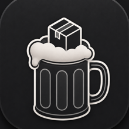
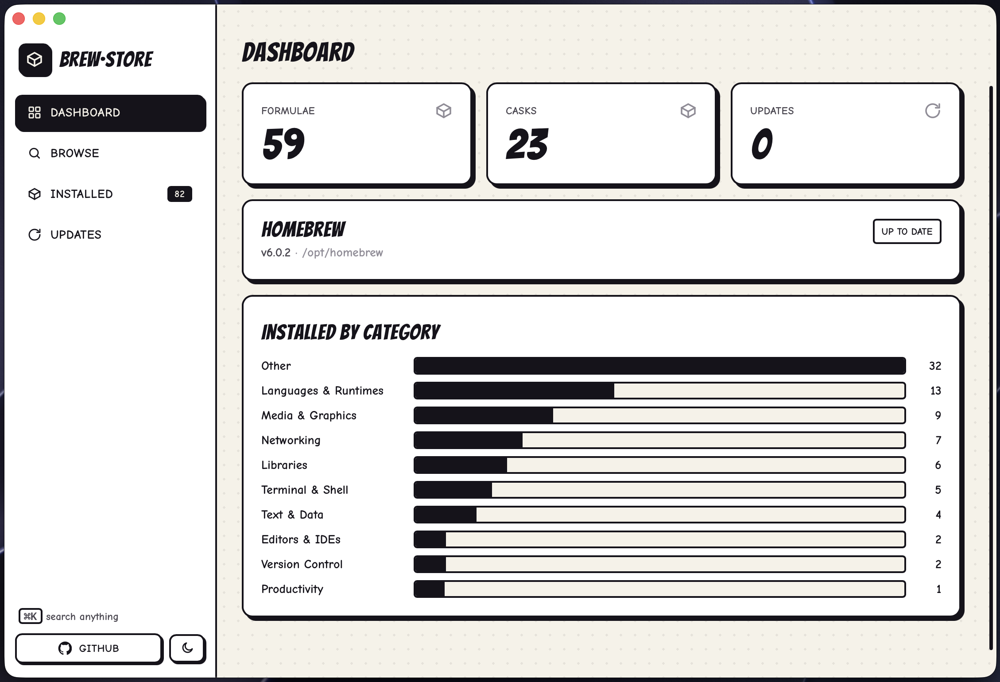
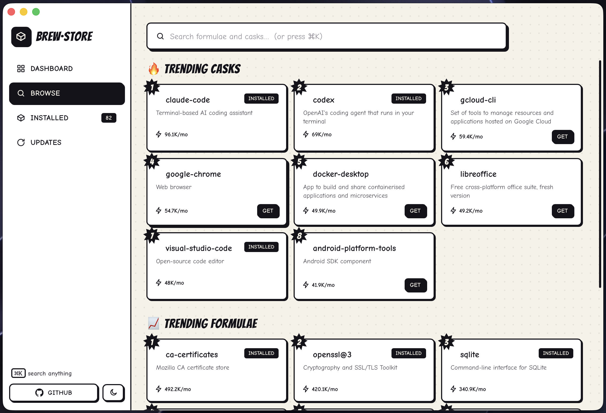
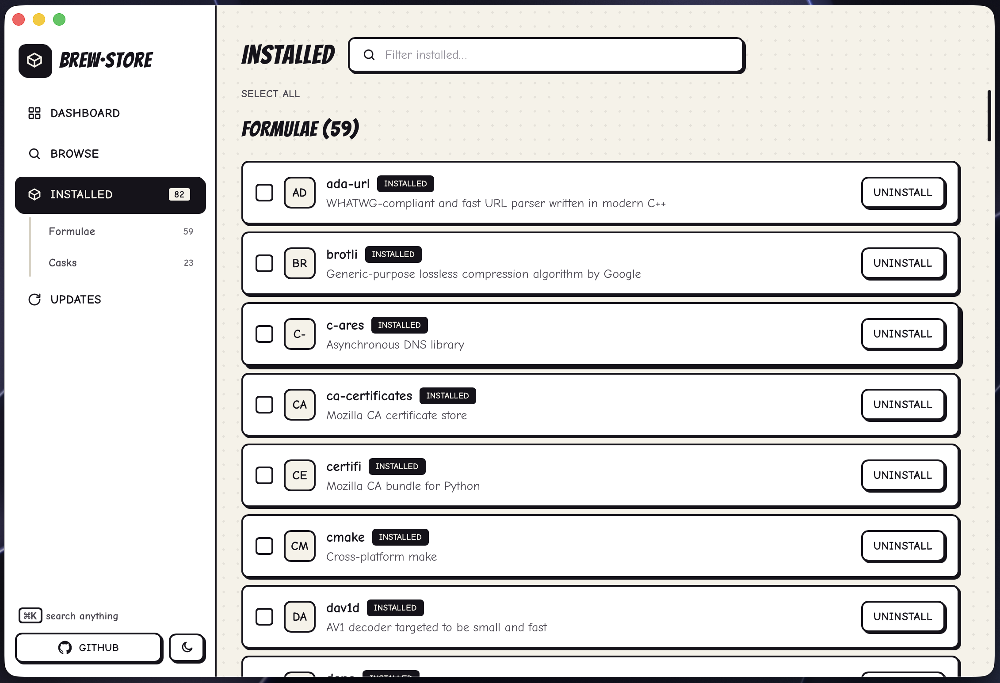

<p align="center"></p>

# brew·store

**A modern, native macOS app for [Homebrew](https://brew.sh) — search, install, and manage your packages without ever touching the terminal.** Fast, keyboard-friendly, with a hand-drawn black-&-white comic-book look.

[](LICENSE)

> ⚠️ brew·store runs real `brew` commands on your Mac. Installing, updating, and uninstalling actually change your system.

## What is it?

Homebrew is the package manager most Mac developers use — but it's terminal-only. brew·store gives it a proper graphical home: a searchable storefront for all ~16,000 Homebrew formulae and casks, one-click install/uninstall with live progress, a dashboard of what you've got, and update management — all in a polished native window.

## Screenshots







## Features

- **📊 Dashboard** — counts of installed formulae & casks, available updates, your Homebrew version & prefix (and whether Homebrew itself is out of date), plus a breakdown of your library by category.
- **🔎 Browse** — instant ranked search across the whole catalog, with a **Trending this month** view powered by Homebrew's real install analytics.
- **⚡ Live install** — every install / update / uninstall streams `brew`'s output into an animated panel.
- **📦 Installed** — split into **Formulae** and **Casks**, with filtering, multi-select, and bulk uninstall.
- **🔄 Updates** — see what's outdated, update one or all, or run a real `brew update` to check upstream.
- **⌘K command palette**, light & dark themes, and full keyboard navigation.

## Build & run

brew·store isn't on the Mac App Store (a sandboxed app can't run `brew`) and has no pre-built download yet, so you build it locally. It's a handful of copy-paste commands.

**Tested on:** macOS on Apple Silicon. (Intel Macs may work as long as `brew` is on your `PATH`, but that's untested.)

### 1. Install the toolchain (one time)

You need four things — **Homebrew**, **Xcode Command Line Tools**, **Node.js**, and **Rust**:

```bash
# Homebrew — skip if you already have it
/bin/bash -c "$(curl -fsSL https://raw.githubusercontent.com/Homebrew/install/HEAD/install.sh)"

# Xcode Command Line Tools (C compiler + macOS SDK)
xcode-select --install

# Node.js (v20 or newer)
brew install node

# Rust (official installer — accept the defaults)
curl --proto '=https' --tlsv1.2 -sSf https://sh.rustup.rs | sh
source "$HOME/.cargo/env"
```

Confirm everything is ready:

```bash
node --version    # v20 or newer
cargo --version   # any recent stable
brew --version    # Homebrew is what the app drives
```

### 2. Clone and run

```bash
git clone https://github.com/nitishmalpotra/brew-store.git
cd brew-store
npm install
npm run tauri dev
```

The **first launch compiles the Rust backend**, so give it a minute or two — later launches are instant. A window opens on the Dashboard.

### 3. Build a standalone app (optional)

```bash
npm run tauri build
```

The finished app lands at:

```
src-tauri/target/release/bundle/macos/brew-store.app
```

Drag it into `/Applications` and open it like any other app. It's an unsigned local build, so if you copy it to a **different** Mac, that Mac will warn on first launch — right-click the app → **Open** to get past Gatekeeper.

### Troubleshooting

- **`cargo: command not found`** — run `source "$HOME/.cargo/env"`, or just open a new terminal.
- **`xcrun: error: invalid active developer path`** — run `xcode-select --install`.
- **Window opens but no packages load** — make sure `brew` works in your own terminal (`brew --version`); the app shells out to your local Homebrew.

## Using it

- **First launch:** if Homebrew isn't installed, BrewStore walks you through installing it (browsing the catalog still works without it).
- Launch the app — it opens on the **Dashboard** with an overview of your setup.
- Go to **Browse**, start typing (or hit **⌘K**), and click a package to see details. Hit **Install** — you'll watch `brew` work in real time.
- **Installed** lists everything you have; use the **Formulae** / **Casks** sub-tabs, filter, tick several, and bulk-uninstall.
- **Updates** shows what's outdated; update individually or **Update all**. **Check for updates** runs `brew update` to pull the latest from upstream.
- Toggle **light / dark** with the button at the bottom-left.

## How it works

Homebrew has no GUI API, so brew·store splits the work:

- **Browsing, search, and trending** hit Homebrew's public JSON API (`formulae.brew.sh`) directly from the UI and cache results locally (daily).
- **Local operations** (`list`, `outdated`, `install`, `uninstall`, `upgrade`, `update`, `--version`, `--prefix`) shell out to your local `brew` binary from a small Rust backend, streaming output back to the UI.

Built with [Tauri 2](https://tauri.app) (Rust) + [React 19](https://react.dev) + [TypeScript](https://www.typescriptlang.org/) + [Vite](https://vite.dev) + [Tailwind CSS 4](https://tailwindcss.com). Because a sandboxed Mac-App-Store app can't run `brew`, this ships as a direct-download app.

## Security

- The Rust backend only runs an **allowlisted** set of `brew` subcommands; arguments are passed to the process without a shell (no shell-injection vector).
- A **Content-Security-Policy** restricts the webview to the app itself plus the Homebrew/GitHub/Google-Fonts endpoints it actually needs.
- External links are limited to `http(s)` and opened in your default browser. All package data is rendered as text (no HTML injection).

## Contributing

Issues and PRs welcome. Follow **Build & run** above to get a dev environment — `npm run tauri dev` hot-reloads, and `npm run build` type-checks and builds the frontend.

## License

[MIT](LICENSE) © Nitish Malpotra
